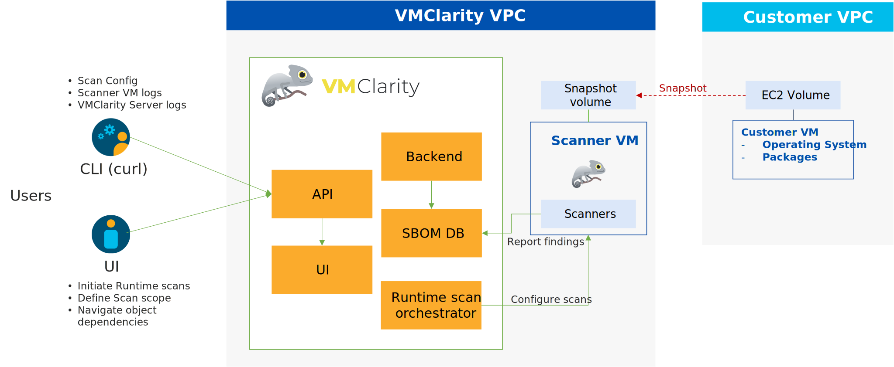

<picture>
  <source media="(prefers-color-scheme: dark)" srcset="./img/logos/VMClarity-logo-dark-bg-horizontal@4x.png">
  <source media="(prefers-color-scheme: light)" srcset="./img/logos/VMClarity-logo-light-bg-horizontal@4x.png">
  
</picture>

VMClarity is an open source tool for agentless detection and management of Virtual Machine
Software Bill Of Materials (SBOM) and vulnerabilities.

# Table of Contents<!-- omit in toc -->

- [Why VMClarity?](#why-vmclarity)
- [Overview](#overview)
- [VMClarity Project Goals](#vmclarity-project-goals)
- [High Level Architecture](#high-level-architecture)
- [Getting Started](#getting-started)
  - [Installing on AWS](#installing-on-aws)
    - [Deploy the VMClarity AWS CloudFormation Stack](#deploy-the-vmclarity-aws-cloudformation-stack)
    - [Accessing the API and UI](#accessing-the-api-and-ui)
  - [Configure Your First Scan](#configure-your-first-scan)
- [Detailed Deployment Guide](#detailed-deployment-guide)
- [Contributing](#contributing)
- [Code of Conduct](#code-of-conduct)
- [License](#license)

# Why VMClarity?

Virtual machines (VMs) are the most used service across all hypescalers. AWS,
Azure, GCP, and others have virtual computing services that are used not only
as standalone VM services but also as the most popular method for hosting
containers (e.g., Docker, Kubernetes).

VMs are vulnerable to multiple threats:
- Software vulnerabilties
- Leaked Secrets/Passwords
- Malware
- System Misconfiguration
- Rootkits

There are many very good open source and commercial-based solutions for
providing threat detection for VMs including:
- Vulnerability detection
- Malware detection
- Exploit detection
- etc.

There are challenges with assembling and managing these tools yourself:
- Complex installation, configuration, and reporting
- Integration with deployment automation
- Siloed reporting and visualization

The VMClarity project is focused on unifying detection and management of VM
vulnerabilities.

# Overview

VMClarity uses a pluggable scanning infrastructure to provide:
- SBOM analysis
- Package and OS vulnerability detection
- Exploit detection
- Leaked secret detection
- Malware detection
- Misconfiguration detection
- Rootkit detection

The pluggable scanning infrastructure uses several tools that can be
enabled/disabled on an individual basis. VMClarity normalizes, merges and
provides a robust visualization of the results from these various tools.

These tools include:
- SBOM Generation and Analysis
  - [Syft](https://github.com/anchore/syft)
  - [Trivy](https://github.com/aquasecurity/trivy)
  - [Cyclonedx-gomod](https://github.com/CycloneDX/cyclonedx-gomod)
- Vulnerability detection
  - [Grype](https://github.com/anchore/grype)
  - [Trivy](https://github.com/aquasecurity/trivy)
  - [Dependency-Track](https://github.com/DependencyTrack/dependency-track)
- Exploits
  - [Go exploit db](https://github.com/vulsio/go-exploitdb)
- Secrets
  - [gitleaks](https://github.com/gitleaks/gitleaks)
- Malware
  - [ClamAV](https://github.com/Cisco-Talos/clamav)
- Misconfiguration
  - [Lynis](https://github.com/CISOfy/lynis)
- Rootkits
  - [Chkrootkit](https://github.com/Magentron/chkrootkit)

# VMClarity Project Goals

- **Increase the adoption of VMClarity**: One of the primary goals of VMClarity
  is to reduce the number of vulnerable VMs in the world. We hope to do this by
  getting more people involved in the project. This involves feature development,
  marketing efforts, improving the user experience, and providing additional
  documentation and resources to make it easier for users to get started.

- **Improve the accuracy of VMClarity**: Another goal is to enhance the
  accuracy across all supported types of threat detection by improving the
  analysis and result merging logic performed by VMClarity to reduce false
  positives. This involves researching and developing improved algorithms and
  heuristics used by VMClarity.

- **Expand VMClarity's functionality**: A third goal is to expand the
  functionality of VMClarity by adding additional tools to each family, adding
  additional families of threats to detect, and integrating with other security
  tools to provide a more comprehensive security solution.

- **Foster a community around VMClarity**: VMClarity will only be successful if
  we foster a community of users and developers around the project. The health
  of VMClarity depends on organizing events, creating a forum for users to drive
  requirements and use cases, and contributing to open-source projects related to
  VMClarity. Building a strong community around VMClarity will help it be more
  widely adopted and more effective at detecting and managing virtual machine
  threats.

# High Level Architecture

Today, VMClarity has two halves, the VMClarity infrastructure, and the VMClarity CLI.

The VMClarity infrastructure includes:

- **Backend**: The core component of VMClarity. Within this service there are
  sub-components (it is in the roadmap to break these into dedicated microservices):

  - **API**: The VMClarity API for managing all objects in the VMClarity
    system. This is the only component in the system which talks to the DB.

  - **Orchestrator**: Orchestrates and manages the life cycle of VMClarity scan
    configs, scans and scan results. Within the Orchestrator there is a
    pluggable "provider" which connects the orchstrator to the environment to be
    scanned and abstracts target discovery, VM snapshotting as well as creation of
    the scanner VMs. (**Note** The only supported provider today is AWS, other
    hyperscalers are on the roadmap)

  - **UI Backend**: A separate backend API which offloads some processing from
    the browser to the infrastructure to process and filter data closer to the
    source.

  - **UI Server**: A server serving the UI static files.

- **DB**: Stores the VMClarity objects from the API. Today this is SQLite but
  the database interface in VMClarity is pluggable and additional DB support
  can be added. (Postgres is in the roadmap)

- **Scanner services**: These services provide support to the VMClarity
  CLI to offload work that would need to be done in ever scanner, for example
  downloading the latest vulnerability or malware signatures from the various DB
  sources. The components included today are:
  - grype-server: A rest API wrapper around the grype vulnerbility scanner
  - trivy-server: Trivy vulnerability scanner server
  - exploitDB server: A test API which wraps the Exploit DB CVE to exploit mapping logic
  - freshclam-mirror: A mirror of the ClamAV malware signatures

The VMClarity CLI contains all the logic for performing a scan, from mounting
attached volumes and all the pluggable infrastructure for all the families, to
exporting the results to VMClarity API.

These components are containerized and can be deployed in a number of different
ways. For example our cloudformation installer deploys VMClarity on a VM using
docker in an dedicated AWS Virtual Private Cloud (VPC).

Once the VMClarity server instance has been deployed, and the scan
configurations have been created, VMClarity will discover VM resources within
the scan range defined by the scan configuration (e.g., by region, instance
tag, and security group). Once the target list has been created, snapshots of
the targets are taken, and a new scanner VM are launched using the snapshots as
attached volumes. The VMClarity CLI running within the scanner VM will perform
the configured analysis on the mounted snapshot, and report the results to the
VMClarity API. These results are then processed by the VMClarity backend into
findings.

Figure 1. VMClarity Architecture Overview


# Getting Started

## Installing on AWS

An AWS CloudFormation template is provided for quick deployment of the
VMClarity environment. **Note**: To avoid extra costs (cross-region snapshots),
you may want to deploy the VMClarity AWS CloudFormation template in the same
region where the majority of VMs are that you want VMClarity to scan.

Figure 2 illustrates the basic AWS resources that the VMClarity CloudFormation
template creates. The AWS CloudFormation template creates a single VPC with a
public and private subnet. An AWS Internet Gateway (IGW) and NAT Gateway (NGW)
are deployed in the VPC.

The public subnet (VmClarityServerSubnet) hosts the VMClarity Server
(VmClarityServer) EC2 instance. The VMClarity server is what houses the
scanning configuration, UI and other control components. The EC2 instance is
assigned an external IPv4 address (EIP) for SSH and web UI access.

The private subnet (VmClarityScannerSubnet) hosts the VM snapshot instances
(EC2) that are scanned for security vulnerabilities.

Figure 2. VMClarity Cloud Formation Resources


To begin either:
* Download the latest stable VMClarity.cfn from the choosen VMClarity release
  [here](https://github.com/openclarity/vmclarity/releases)

* Clone or copy the 
  file from main to deploy the latest development code.

### Deploy the VMClarity AWS CloudFormation Stack

Go to the AWS CloudFormation service page: > Create Stack > With New Resources
(standard)> Check "Template is ready", and Check "Upload a template file" >
Upload a template file/Choose file.

- Name the stack
- Select the InstanceType (defaults to t2.large for the VMClarity Server, and the scanner VMs)
- KeyName - Choose your SSH key for the EC2 instance
- SSHLocation - Adjust per your policies
- AdvancedConfiguration - Leave as-is unless you are building from a custom registry

Click "NEXT"

- Tags: Add as you wish
- Leave defaults unless you need to adjust for your own policies

Click "NEXT"
Scroll to the bottom of the screen, and check "I acknowledge..."

Click "SUBMIT"

After a few minutes the stack will be deployed, and you can get the VMClarity
server instance public IPv4 address from the AWS CloudFormation "Outputs" tab.

### Accessing the API and UI

- To access the API, a tunnel to the HTTP ports must be opened using the
VMClarity server as a bastion.

```
ssh -N -L 8888:localhost:8888 ubuntu@<VMClarity public IP address>
```

- Once SSH tunnel has been configured, the VMClarity API can be accessed on
  <http://localhost:8888>. Figure 3 shows the default VMClarity UI dashboard.
  No scans, assets or findings will be shown yet. A scan configuration is
  required to be added to the environment.

Figure 3. VMClarity UI Dashboard


## Configure Your First Scan

- Click on the "Scans" icon as shown in Figure 4. In the Scans window, you can create a new scan configuration.

Figure 4. VMClarity UI Scan


- Create a new scan configuration. As shown in Figure 5, click on "New scan configuration".

Figure 5. VMClarity Scan Setup Step 1


- In the "New scan config" wizard shown in Figure 6, follow the wizard steps to name the scan, and identify the AWS scope (region, VPC, security groups, etc). In the example shown in Figure 6, the AWS us-east-2 region, and a specific VPC were identied as well as a specific EC2 instance with the name "vmclarity-demo-vm".

Figure 6. VMClarity Scan Setup Step 2


- Next, identify all of the scan types you want enabled. As Figure 7 shows, all of the available scan types have been enabled.

Figure 7. VMClarity Scan Setup Step 3


- Finally, select the scan time and/or frequency of the scans. Figure 8 shows the scan option of "now", but other options include "specific time" and "recurring" (Based on a cron job).

Figure 8. VMClarity Scan Setup Step 4


- Once all of the scan setup steps have been entered, click on "Save".

In the Scan Configurations tab, you will see the scan config listed as shown in Figure 9.

Figure 9. VMClarity Scan Configuration List


Once a scan runs and generates findings, you can browse around the various VMClarity UI features and investigate the security scan reports.

Here are a few of the many scan findings that are available in the VMClarity UI.

Figure 10. VMClarity Scan List


Figure 11. VMClarity Dashboard


# Detailed Deployment Guide

A detailed Deployment Guide is available at: <URL FOR docs/deployment-guide.md> and includes information on:
- AWS CloudFormation Stack build with screenshots
- How to interact with the VMClarity API via command line and UI
- How to check logs (cloud-init in the scanner VM, real-time scanner logs)
- How to use the VMClarity UI

# Contributing

If you are ready to jump in and test, add code, or help with documentation,
please follow the instructions on our [contributing guide](/CONTRIBUTING.md)
for details on how to open issues, setup VMClarity for development and test.

# Code of Conduct

You can view our code of conduct [here](/CODE_OF_CONDUCT.md).

# License

[Apache License, Version 2.0](/LICENSE)
