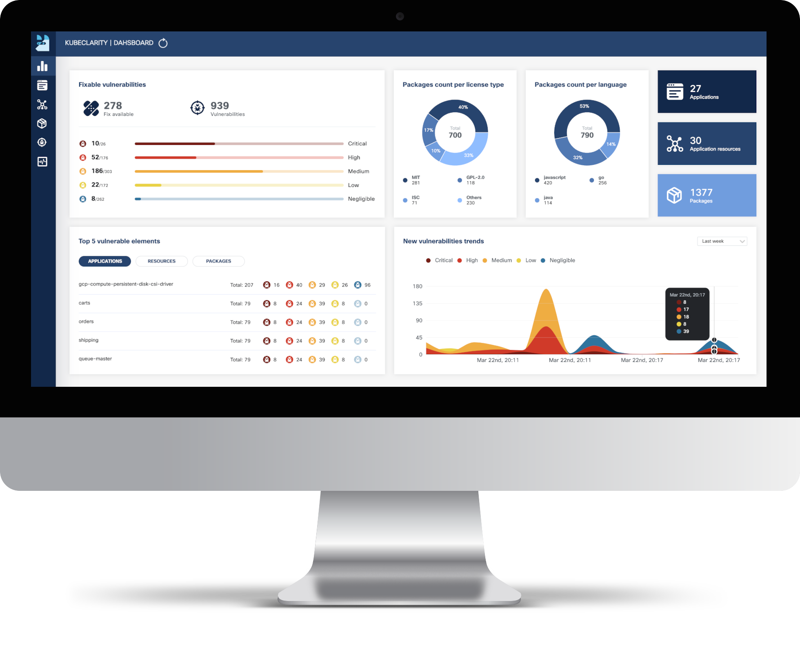

KubeClarity is a tool for detection and management of Software Bill Of Materials (SBOM) and vulnerabilities of container images and filesystems. It scans both runtime K8s clusters and CI/CD pipelines for enhanced software supply chain security.



# Table of Contents

- [Why?](#why)
  - [SBOM & Vulnerability detection challenges](#sbom--vulnerability-detection-challenges)
  - [Solution](#solution)
- [Features](#features)
  - [Integrated SBOM generators and vulnerability scanners](#integrated-sbom-generators-and-vulnerability-scanners)
- [Architecture](#architecture)
- [Getting Started](#getting-started)
  - [KubeClarity Backend](#kubeclarity-backend)
    - [Install using Helm](#install-kubeclarity-in-a-k8s-cluster-using-helm)
    - [Build and Run Locally with Demo Data](#build-and-run-locally-with-demo-data)
  - [CLI](#cli)
    - [Installation](#installation)
    - [SBOM Generation](#sbom-generation)
    - [Vulnerability Scanning](#vulnerability-scanning)
    - [Exporting results to KubeClarity Backend](#exporting-results-to-kubeclarity-backend)
- [Advanced Configuration](#advanced-configuration)
  - [SBOM generation using local docker image as input](#sbom-generation-using-local-docker-image-as-input)
  - [Vulnerability scanning using local docker image as input](#vulnerability-scanning-using-local-docker-image-as-input)
  - [Private Registry Support For CLI](#private-registry-support-for-cli)
  - [Private Registry Support For K8s Runtime Scan](#private-registries-support-for-k8s-runtime-scan)
  - [Merging of SBOM and vulnerabilities across different CI/CD stages](#merging-of-sbom-and-vulnerabilities-across-different-cicd-stages)
  - [Remote Scanner Servers For CLI](#remote-scanner-servers-for-cli)
- [Limitations](#limitations)
- [Contributing](#contributing)
- [License](#license)

# Why?
## SBOM & Vulnerability Detection Challenges

* Effective vulnerability scanning requires an accurate Software Bill Of Materials (SBOM) detection:
  * Various programming languages and package managers
  * Various OS distributions
  * Package dependency information is usually stripped upon build
* Which one is the best scanner/SBOM analyzer?
* What should we scan: Git repos, builds, container images or runtime?
* Each scanner/analyzer has its own format - how to compare the results?
* How to manage the discovered SBOM and vulnerabilities?
* How are my applications affected by a newly discovered vulnerability?

## Solution

* Separate vulnerability scanning into 2 phases:
  * Content analysis to generate SBOM
  * Scan the SBOM for vulnerabilities
* Create a pluggable infrastructure to:
  * Run several content analyzers in parallel
  * Run several vulnerability scanners in parallel
* Scan and merge results between different CI stages using KubeClarity CLI
* Runtime K8s scan to detect vulnerabilities discovered post-deployment
* Group scanned resources (images/directories) under defined applications to navigate the object tree dependencies (applications, resources, packages, vulnerabilities)

# Features

* Dashboard
  * Fixable vulnerabilities per severity
  * Top 5 vulnerable elements (applications, resources, packages)
  * New vulnerabilities trends
  * Package count per license type
  * Package count per programming language
  * General counters
* Applications
  * Automatic application detection in K8s runtime
  * Create/edit/delete applications
  * Per application, navigation to related:
    * Resources (images/directories)
    * Packages
    * Vulnerabilities
    * Licenses in use by the resources
* Application Resources (images/directories)
  * Per resource, navigation to related:
    * Applications
    * Packages
    * Vulnerabilities
* Packages
    * Per package, navigation to related:
        * Applications
        * Linkable list of resources and the detecting SBOM analyzers
        * Vulnerabilities
* Vulnerabilities
    * Per vulnerability, navigation to related:
        * Applications
        * Resources
        * List of detecting scanners
* K8s Runtime scan
  * On-demand or scheduled scanning
  * Automatic detection of target namespaces
  * Scan progress and result navigation per affected element (applications, resources, packages, vulnerabilities)
  * CIS Docker benchmark
* CLI (CI/CD)
  * SBOM generation using multiple integrated content analyzers (Syft, cyclonedx-gomod)
  * SBOM/image/directory vulnerability scanning using multiple integrated scanners (Grype, Dependency-track)
  * Merging of SBOM and vulnerabilities across different CI/CD stages
  * Export results to KubeClarity backend
* API
  * The API for KubeClarity can be found [here](https://github.com/openclarity/kubeclarity/blob/master/api/swagger.yaml)

## Integrated SBOM generators and vulnerability scanners
KubeClarity content analyzer integrates with the following SBOM generators:
* [Syft](https://github.com/anchore/syft)
* [Cyclonedx-gomod](https://github.com/CycloneDX/cyclonedx-gomod)
* [Trivy](https://github.com/aquasecurity/trivy)

KubeClarity vulnerability scanner integrates with the following scanners:
* [Grype](https://github.com/anchore/grype)
* [Dependency-Track](https://github.com/DependencyTrack/dependency-track)
* [Trivy](https://github.com/aquasecurity/trivy)

# Architecture


# Getting Started
## KubeClarity Backend
### Install using Helm:

1. Add Helm repo

   ```shell
   helm repo add kubeclarity https://openclarity.github.io/kubeclarity
   ```
2. Save KubeClarity default chart values
    ```shell
    helm show values kubeclarity/kubeclarity > values.yaml
    ```

3. Check the configuration in `values.yaml` and update the required values if
   needed. To enable and configure the supported SBOM generators and
   vulnerability scanners, please check the "analyzer" and "scanner" config under
   the "vulnerability-scanner" section in Helm values.

4. Deploy KubeClarity with Helm

   ```shell
   helm install --values values.yaml --create-namespace kubeclarity kubeclarity/kubeclarity -n kubeclarity
   ```

   or for OpenShift Restricted SCC compatible install:

   ```shell
   helm install --values values.yaml --create-namespace kubeclarity kubeclarity/kubeclarity -n kubeclarity --set global.openShiftRestricted=true \
     --set kubeclarity-postgresql.securityContext.enabled=false --set kubeclarity-postgresql.containerSecurityContext.enabled=false \
     --set kubeclarity-postgresql.volumePermissions.enabled=true --set kubeclarity-postgresql.volumePermissions.securityContext.runAsUser="auto" \
     --set kubeclarity-postgresql.shmVolume.chmod.enabled=false
   ```

3. Port forward to KubeClarity UI:

   ```shell
   kubectl port-forward -n kubeclarity svc/kubeclarity-kubeclarity 9999:8080
   ```

4. Open KubeClarity UI in the browser: <http://localhost:9999/>

> **NOTE**  
> KubeClarity requires these K8s permissions:
> | Permission | Reason |
> | ---        | ---    |
> | Read secrets in cluster scope. | This is required for getting image pull secrets for scanning private image repositories. |
> | Read config maps in cluster scope. | This is required for getting the configured template of the scanner job. |
> | List pods in cluster scope. | This is required for calculating the target pods that need to be scanned. |
> | List namespaces. | This is required for fetching the target namespaces to scan in K8s runtime scan UI. |
> | Create & delete jobs in cluster scope. | This is required for managing the jobs that will scan the target pods in their namespaces. |

### Build and Run Locally with Demo Data

1. Build UI & backend and start the backend locally (2 options):
    1. Using docker:
        1. Build UI and backend (the image tag is set using VERSION):
           ```shell
           VERSION=test make docker-backend
           ```
        2. Run the backend using demo data:
           ```shell
           docker run -p 8080:8080 -e FAKE_RUNTIME_SCANNER=true -e FAKE_DATA=true -e ENABLE_DB_INFO_LOGS=true -e DATABASE_DRIVER=LOCAL ghcr.io/openclarity/kubeclarity:test run
           ```
    2. Local build:
        1. Build UI and backend
           ```shell
           make ui && make backend
           ```
        2. Copy the built site:
           ```shell
           cp -r ./ui/build ./site
           ```
        3. Run the backend locally using demo data:
           ```shell
           FAKE_RUNTIME_SCANNER=true DATABASE_DRIVER=LOCAL FAKE_DATA=true ENABLE_DB_INFO_LOGS=true ./backend/bin/backend run
           ```

2. Open KubeClarity UI in the browser: <http://localhost:8080/>

## CLI

KubeClarity includes a CLI that can be run locally and especially useful for CI/CD pipelines.
It allows to analyze images and directories to generate SBOM, and scan it for vulnerabilities.
The results can be exported to KubeClarity backend.

### Installation

<details><summary>Binary Distribution</summary><p>

Download the release distribution for your OS from the
[releases page](https://github.com/openclarity/kubeclarity/releases)

Unpack the `kubeclarity-cli` binary, add it to your PATH, and you are good to go!

</p></details>

<details><summary>Docker Image</summary><p>

A Docker image is available at `ghcr.io/openclarity/kubeclarity-cli` with list of
available tags [here](https://github.com/openclarity/kubeclarity/pkgs/container/kubeclarity-cli/versions).

</p></details>

<details><summary>Local Compilation</summary><p>

```
make cli
```

Copy `./cli/bin/cli` to your PATH under `kubeclarity-cli`.

</p></details>

### SBOM Generation

Usage:
```
kubeclarity-cli analyze <image/directory name> --input-type <dir|file|image(default)> -o <output file or stdout>
```

Example:
```
kubeclarity-cli analyze --input-type image nginx:latest -o nginx.sbom
```

Optionally a list of the content analyzers to use can be configured using the `ANALYZER_LIST` env
variable seperated by a space (e.g `ANALYZER_LIST="<analyzer 1 name> <analyzer 2 name>"`)

Example:
```
ANALYZER_LIST="syft gomod" kubeclarity-cli analyze --input-type image nginx:latest -o nginx.sbom
```

### Vulnerability Scanning

Usage:
```
kubeclarity-cli scan <image/sbom/directoty/file name> --input-type <sbom|dir|file|image(default)> -f <output file>
```

Example:
```
kubeclarity-cli scan nginx.sbom --input-type sbom
```

Optionally a list of the vulnerability scanners to use can be configured using the `SCANNERS_LIST` env
variable seperated by a space (e.g `SCANNERS_LIST="<Scanner1 name> <Scanner2 name>"`)

Example:
```
SCANNERS_LIST="grype trivy" kubeclarity-cli scan nginx.sbom --input-type sbom
```

### Exporting Results to KubeClarity Backend

To export CLI results to the KubeClarity backend, need to use an application ID as defined by the KubeClarity backend.
The application ID can be found in the Applications screen in the UI or using the KubeClarity API.

#### Exporting SBOM

```
# The SBOM can be exported to KubeClarity backend by setting the BACKEND_HOST env variable and the -e flag.
# Note: Until TLS is supported, BACKEND_DISABLE_TLS=true should be set.
BACKEND_HOST=<KubeClarity backend address> BACKEND_DISABLE_TLS=true kubeclarity-cli analyze <image> --application-id <application ID> -e -o <SBOM output file>

# For example:
BACKEND_HOST=localhost:9999 BACKEND_DISABLE_TLS=true kubeclarity-cli analyze nginx:latest --application-id 23452f9c-6e31-5845-bf53-6566b81a2906 -e -o nginx.sbom
```

#### Exporting Vulnerability Scan Results

```
# The vulnerability scan result can be exported to KubeClarity backend by setting the BACKEND_HOST env variable and the -e flag.
# Note: Until TLS is supported, BACKEND_DISABLE_TLS=true should be set.

BACKEND_HOST=<KubeClarity backend address> BACKEND_DISABLE_TLS=true kubeclarity-cli scan <image> --application-id <application ID> -e

# For example:
SCANNERS_LIST="grype" BACKEND_HOST=localhost:9999 BACKEND_DISABLE_TLS=true kubeclarity-cli scan nginx.sbom --input-type sbom  --application-id 23452f9c-6e31-5845-bf53-6566b81a2906 -e
```

# Advanced Configuration
## SBOM generation using local docker image as input

```
# Local docker images can be analyzed using the LOCAL_IMAGE_SCAN env variable

# For example:
LOCAL_IMAGE_SCAN=true kubeclarity-cli analyze nginx:latest -o nginx.sbom
```

## Vulnerability scanning using local docker image as input

```
# Local docker images can be scanned using the LOCAL_IMAGE_SCAN env variable

# For example:
LOCAL_IMAGE_SCAN=true kubeclarity-cli scan nginx.sbom
```

## Private registry support For CLI

The KubeClarity cli can read a config file that stores credentials for private registries.

Example registry section of the config file:
```
registry:
  auths:
    - authority: <registry 1>
      username: <username for registry 1>
      password: <password for registry 1>
    - authority: <registry 2>
      token: <token for registry 2>
```

Example registry config without authority: (in this case these credentials will be used for all registries)
```
registry:
  auths:
    - username: <username>
      password: <password>
```

### Specify config file for CLI

```
# The default config path is $HOME/.kubeclarity or it can be specified by `--config` command line flag.
# kubeclarity <scan/analyze> <image name> --config <kubeclarity config path>

# For example:
kubeclarity scan registry/nginx:private --config $HOME/own-kubeclarity-config
```


## Private registries support for K8s runtime scan

Kubeclarity is using [k8schain](https://github.com/google/go-containerregistry/tree/main/pkg/authn/k8schain#k8schain) of google/go-containerregistry for authenticating to the registries.
If the necessary service credentials are not discoverable by the k8schain, they can be defined via secrets described below.

### Amazon ECR

Create an [AWS IAM user](https://docs.aws.amazon.com/IAM/latest/UserGuide/id_users_create.html#id_users_create_console) with `AmazonEC2ContainerRegistryFullAccess` permissions.

Use the user credentials (`AWS_ACCESS_KEY_ID`, `AWS_SECRET_ACCESS_KEY`, `AWS_DEFAULT_REGION`) to create the following secret:

```
cat <<EOF | kubectl apply -f -
apiVersion: v1
kind: Secret
metadata:
  name: ecr-sa
  namespace: kubeclarity
type: Opaque
data:
  AWS_ACCESS_KEY_ID: $(echo -n 'XXXX'| base64 -w0)
  AWS_SECRET_ACCESS_KEY: $(echo -n 'XXXX'| base64 -w0)
  AWS_DEFAULT_REGION: $(echo -n 'XXXX'| base64 -w0)
EOF
```

Note:
1. Secret name must be `ecr-sa`
2. Secret data keys must be set to `AWS_ACCESS_KEY_ID`, `AWS_SECRET_ACCESS_KEY` and `AWS_DEFAULT_REGION`

### Google GCR

Create a [Google service account](https://cloud.google.com/docs/authentication/getting-started#creating_a_service_account) with `Artifact Registry Reader` permissions.

Use the service account json file to create the following secret

```
kubectl -n kubeclarity create secret generic --from-file=sa.json gcr-sa
```

Note:
1. Secret name must be `gcr-sa`
1. `sa.json` must be the name of the service account json file when generating the secret
2. KubeClarity is using [application default credentials](https://developers.google.com/identity/protocols/application-default-credentials). These only work when running KubeClarity from GCP.

## Merging of SBOM and vulnerabilities across different CI/CD stages

```
# Additional SBOM will be merged into the final results when '--merge-sbom' is defined during analysis. The input SBOM can be CycloneDX XML or CyclonDX json format.
# For example:
ANALYZER_LIST="syft" kubeclarity-cli analyze nginx:latest -o nginx.sbom --merge-sbom inputsbom.xml
```

## Remote Scanner Servers For CLI

When running the kubeclarity CLI to scan for vulnerabilties, the CLI will need
to download the relevant vulnerablity DBs to the location where the kubeclarity
CLI is running. Running the CLI in a CI/CD pipeline will result in downloading
the the DBs on each run, wasting time and bandwidth. For this reason several of
the supported scanners have a remote mode in which a server is responsible for
the DB management and possibly scanning of the artifacts.

> ***Note***
>
> The examples below are for each of the scanners, but they can be combined to
> run together the same as they can be in non-remote mode.

### Trivy

Trivy scanner supports remote mode using the Trivy server. The trivy server can
be deployed as documented here: [trivy client-server mode](https://aquasecurity.github.io/trivy/v0.34/docs/references/modes/client-server/).
Instructions to install the Trivy CLI are available here: [trivy install](https://aquasecurity.github.io/trivy/v0.34/getting-started/installation/).
The Aqua team provide an offical container image that can be used to run the
server in kubernetes/docker which we'll use in the examples here.

To start the server:
```
docker run -p 8080:8080 --rm aquasec/trivy:0.34.0 server --listen 0.0.0.0:8080
```

To run a scan using the server:
```
SCANNERS_LIST="trivy" SCANNER_TRIVY_SERVER_ADDRESS="http://<trivy server address>:8080" ./kubeclarity_cli scan --input-type sbom nginx.sbom
```

The trivy server also provides token based authentication to prevent
unauthorized use of a trivy server instance. You can enable it by running the
server with the extra flag:

```
docker run -p 8080:8080 --rm aquasec/trivy:0.34.0 server --listen 0.0.0.0:8080 --token mytoken
```

and passing the token to the scanner:
```
SCANNERS_LIST="trivy" SCANNER_TRIVY_SERVER_ADDRESS="http://<trivy server address>:8080" SCANNER_TRIVY_SERVER_TOKEN="mytoken" ./kubeclarity_cli scan --input-type sbom nginx.sbom
```

### Grype

Grype supports remote mode using [grype-server](https://github.com/portshift/grype-server)
a RESTful grype wrapper which provides an API that receives an SBOM and returns
the grype scan results for that SBOM. Grype-server ships as a container image
so can be run in kubernetes or via docker standalone.

To start the server:
```
docker run -p 9991:9991 --rm gcr.io/eticloud/k8sec/grype-server:v0.1.4
```

To run a scan using the server:
```
SCANNERS_LIST="grype" SCANNER_GRYPE_MODE="remote" SCANNER_REMOTE_GRYPE_SERVER_ADDRESS="<grype server address>:9991" ./kubeclarity_cli scan --input-type sbom nginx.sbom
```

### Dependency Track

See example configuration [here](shared/pkg/scanner/dependency_track/example/README.md)

# Limitations

1. Supports Docker Image Manifest V2, Schema 2 (https://docs.docker.com/registry/spec/manifest-v2-2/). It will fail to scan earlier versions.

# Roadmap
* Integration with additional content analyzers (SBOM generators)
* Integration with additional vulnerability scanners
* CIS Docker benchmark in UI
* Image signing using [Cosign](https://github.com/sigstore/cosign)
* CI/CD metadata signing and attestation using [Cosign](https://github.com/sigstore/cosign) and [in-toto](https://github.com/in-toto/in-toto) (supply chain security)
* System settings and user management

# Contributing

Pull requests and bug reports are welcome.

For larger changes please create an Issue in GitHub first to discuss your
proposed changes and possible implications.

## License

[Apache License, Version 2.0](https://www.apache.org/licenses/LICENSE-2.0)
