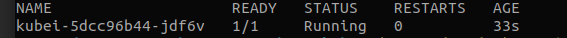
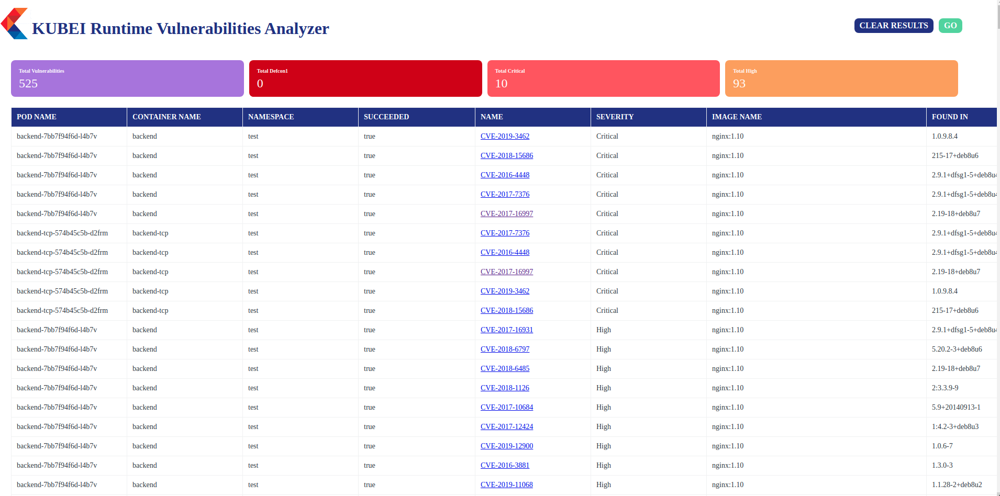

Kubei is a vulnerabilities scanning tool that allows users to get an accurate and immediate risk assessment of their kubernetes clusters. Kubei scans all images that are being used in a Kubernetes cluster, including images of application pods and system pods. It doesn’t scan the entire image registries and doesn’t require preliminary integration with CI/CD pipelines. 

It is a configurable tool which allows users to define the scope of the scan (target namespaces), the speed, and the vulnerabilities level of interest.

It provides a graphical UI which allows the viewer to identify where and what should be replaced, in order to mitigate the discovered vulnerabilities. 


## Prerequisites 

1. A Kubernetes cluster is ready, and kubeconfig ( `~/.kube/config`) is properly configured for the target cluster.

## Required permissions

1. Read secrets in cluster scope. This is required for getting image pull secrets for scanning private image repositories.
2. List pods in cluster scope. This is required for calculating the target pods that need to be scanned.
3. Create jobs in cluster scope. This is required for creating the jobs that will scan the target pods in their namespaces.

## Configurations 

The file `deploy/kubei.yaml` is used to deploy and configure Kubei on your cluster.

1. Set the scan scope. Set the `IGNORE_NAMESPACES` env variable to ignore specific namespaces. Set `TARGET_NAMESPACE` to scan a specific namespace, or leave empty to scan all namespaces.

2. Set the scan speed. Expedite scanning by running parallel scanners. Set the `MAX_PARALLELISM` env variable for the maximum number of simultaneous scanners.

3. Set severity level threshold. Vulnerabilities with severity level higher than or equal to `SEVERITY_THRESHOLD` threshold will be reported. Supported levels are `Unknown`, `Negligible`, `Low`, `Medium`, `High`, `Critical`, `Defcon1`. Default is `Medium`.

4. Set the delete job policy. Set the `DELETE_JOB_POLICY` env variable to define whether or not to delete completed scanner jobs. Supported values are:
    * `All` - All jobs will be deleted.
    * `Successful` - Only successful jobs will be deleted (default).
    * `Never` - Jobs will never be deleted.

## Usage 

1. Run the following command to deploy Kubei on the cluster:

    `
    kubectl apply -f https://raw.githubusercontent.com/Portshift/kubei/master/deploy/kubei.yaml
    `

2. Run the following command to verify that Kubei is up and running:

    `
    kubectl -n kubei get pod -lapp=kubei
    `
    
     

3. Then, port forwarding into the Kubei webapp via the following command:

    `
    kubectl -n kubei port-forward $(kubectl -n kubei get pods -lapp=kubei -o jsonpath='{.items[0].metadata.name}') 8080 
    `    

4. In your browser, navigate to http://localhost:8080/view/ , and then click  'GO' to run a scan.

5. To check the state of Kubei, and the progress of ongoing scans, run the following command:

    `
	kubectl -n kubei logs $(kubectl -n kubei get pods -lapp=kubei -o jsonpath='{.items[0].metadata.name}')  
    `

6. Refresh the page (http://localhost:8080/view/) to update the results.

     

## Running Kubei with an external HTTP/HTTPS proxy

Uncomment and configure the proxy env variables for the Clair and Kubei deployments in `deploy/kubei.yaml`.

## Amazon ECR support

Create an [AWS IAM user](https://docs.aws.amazon.com/IAM/latest/UserGuide/id_users_create.html#id_users_create_console) with `AmazonEC2ContainerRegistryFullAccess` permissions.

Use the user credentials (`AWS_ACCESS_KEY_ID`, `AWS_SECRET_ACCESS_KEY`, `AWS_DEFAULT_REGION`) to create the following secret:

```
cat <<EOF | kubectl apply -f -
apiVersion: v1
kind: Secret
metadata:
  name: ecr-sa
  namespace: kubei
type: Opaque
data:
  AWS_ACCESS_KEY_ID: $(echo -n 'XXXX'| base64 -w0)
  AWS_SECRET_ACCESS_KEY: $(echo -n 'XXXX'| base64 -w0)
  AWS_DEFAULT_REGION: $(echo -n 'XXXX'| base64 -w0)
EOF
```

Note: 
1. Secret name must be `ecr-sa`
2. Secret data keys must be set to `AWS_ACCESS_KEY_ID`, `AWS_SECRET_ACCESS_KEY` and `AWS_DEFAULT_REGION`

## Google GCR support

Create a [Google service account](https://cloud.google.com/docs/authentication/getting-started#creating_a_service_account) with `Artifact Registry Reader` permissions.

Use the service account json file to create the following secret

```
kubectl -n kubei create secret generic --from-file=sa.json gcr-sa
```

Note:
1. Secret name must be `gcr-sa` 
1. `sa.json` must be the name of the service account json file when generating the secret
2. Kubei is using [application default credentials](https://developers.google.com/identity/protocols/application-default-credentials). These only work when running Kubei from GCP.

## Limitations 

1. Supports Kubernetes Image Manifest V 2, Schema 2 (https://docs.docker.com/registry/spec/manifest-v2-2/). It will fail to scan on earlier versions.
 
2. The CVE database will update once a day.
