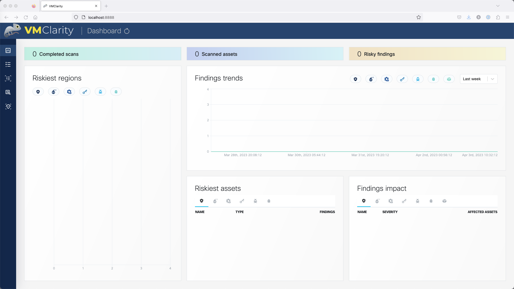
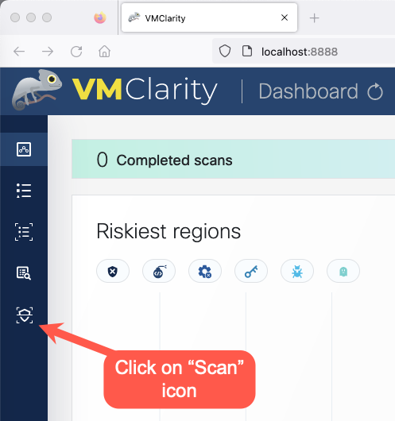
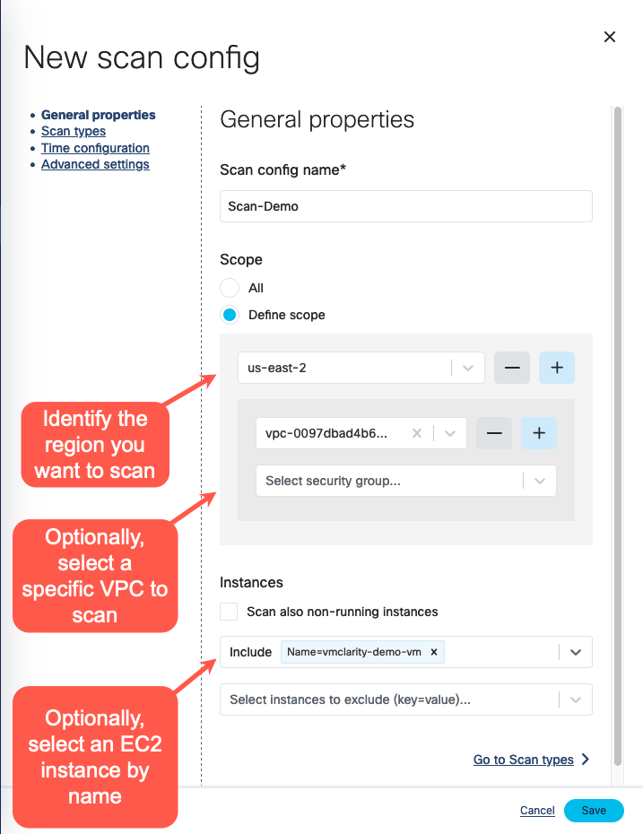
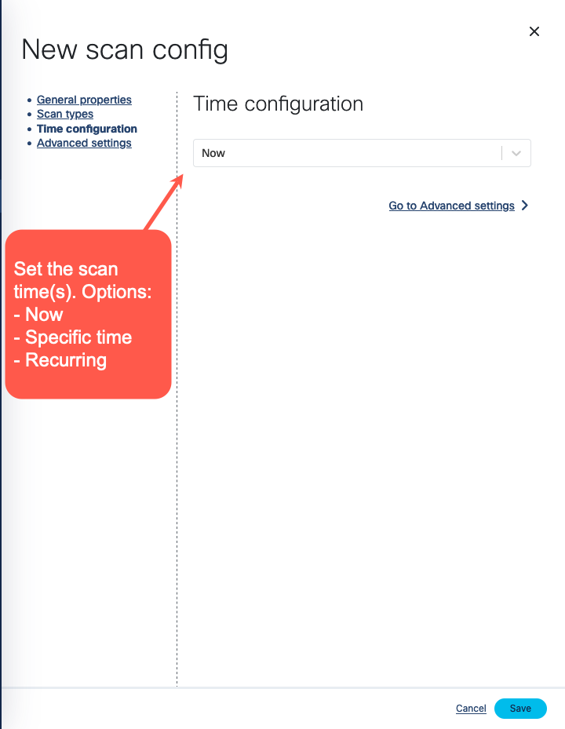
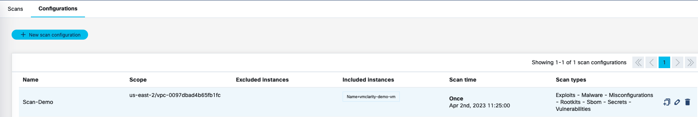
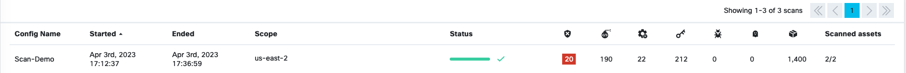
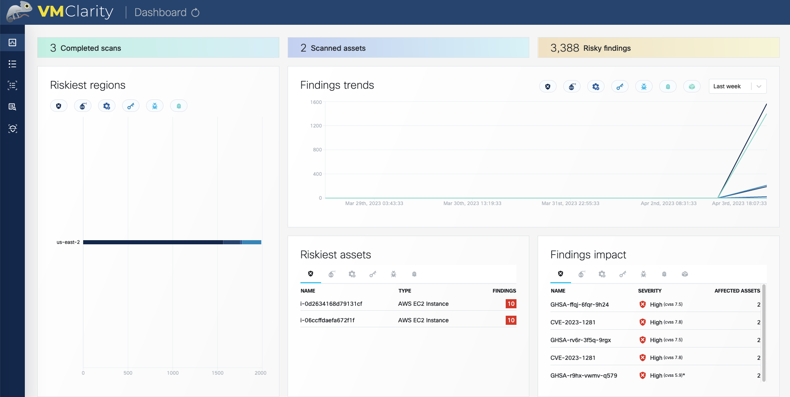

# VMClarity UI Tour
Figure 1. VMClarity UI Dashboard

## Configure Your First Scan

- Click on the "Scans" icon as shown in Figure 2. In the Scans window, you can create a new scan configuration.

Figure 2. VMClarity UI Scan

- Create a new scan configuration. As shown in Figure 3, click on "New scan configuration".

Figure 3. VMClarity Scan Setup Step 1

- In the "New scan config" wizard shown in Figure 4, follow the wizard steps to name the scan, and identify the AWS scope (region, VPC, security groups, etc). In the example shown in Figure 4, the AWS us-east-2 region, and a specific VPC were identied as well as a specific EC2 instance with the name "vmclarity-demo-vm".

Figure 4. VMClarity Scan Setup Step 2

- Next, identify all of the scan types you want enabled. As Figure 5 shows, all of the available scan types have been enabled.

Figure 5. VMClarity Scan Setup Step 3

- Finally, select the scan time and/or frequency of the scans. Figure 6 shows the scan option of "now", but other options include "specific time" and "recurring" (Based on a cron job).

Figure 6. VMClarity Scan Setup Step 4

- Once all of the scan setup steps have been entered, click on "Save".

In the Scan Configurations tab, you will see the scan config listed as shown in Figure 7.

Figure 7. VMClarity Scan Configuration List

Once a scan runs and generates findings, you can browse around the various VMClarity UI features and investigate the security scan reports.

Here are a few of the many scan findings that are available in the VMClarity UI.

Figure 8. VMClarity Scan List

Figure 9. VMClarity Dashboard

