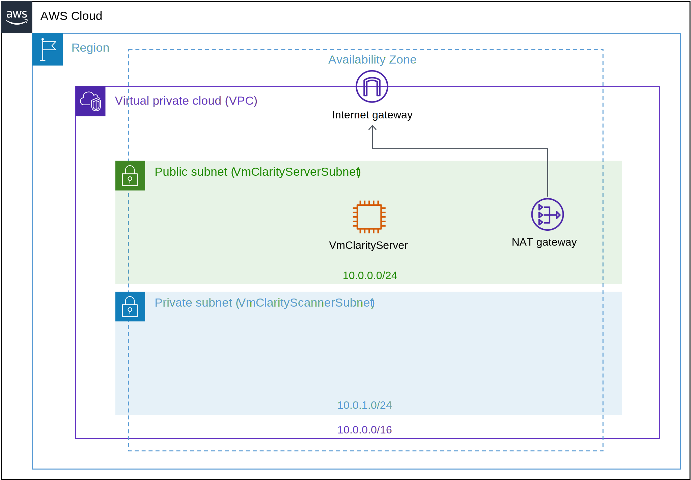

# Installing on AWS
## Table of Contents<!-- omit in toc -->

- [Overview](#overview)
- [Deploy the VMClarity AWS CloudFormation Stack](#deploy-the-vmclarity-aws-cloudformation-stack)

## Overview
An AWS CloudFormation template is provided for quick deployment of the
VMClarity environment. **Note**: To avoid extra costs (cross-region snapshots),
you may want to deploy the VMClarity AWS CloudFormation template in the same
region where the majority of VMs are that you want VMClarity to scan.

Figure 2 illustrates the basic AWS resources that the VMClarity CloudFormation
template creates. The AWS CloudFormation template creates a single VPC with a
public and private subnet. An AWS Internet Gateway (IGW) and NAT Gateway (NGW)
are deployed in the VPC.

The public subnet (VmClarityServerSubnet) hosts the VMClarity Server
(VmClarityServer) EC2 instance. The VMClarity server is what houses the
scanning configuration, UI and other control components. The EC2 instance is
assigned an external IPv4 address (EIP) for SSH and web UI access.

The private subnet (VmClarityScannerSubnet) hosts the VM snapshot instances
(EC2) that are scanned for security vulnerabilities.

Figure 2. VMClarity Cloud Formation Resources

## Deploy the VMClarity AWS CloudFormation Stack

Click [here](https://console.aws.amazon.com/cloudformation/home#/stacks/create/review?stackName=VMClarity&templateURL=https://s3.eu-west-2.amazonaws.com/vmclarity-v0.4.0/VmClarity.cfn) to start the VMClarity CloudFormation Stack wizard.

Alternatively:
* Obtain the CloudFormation template using one of the following:
    * Download the latest stable VMClarity.cfn from the chosen VMClarity release
      [here](https://github.com/openclarity/vmclarity/releases)
    * Clone or copy the [AWS CloudFormation template](./VmClarity.cfn)
      file from main to deploy the latest development code.
* Go to the AWS CloudFormation service page: > Create Stack > With New Resources
  (standard)> Check "Template is ready", and Check "Upload a template file" >
  Upload a template file/Choose file.

In the VMClarity CloudFormation Stack wizard:
- Name the stack
- Select the InstanceType (defaults to t2.large for the VMClarity Server, and the scanner VMs)
- KeyName - Choose your SSH key for the EC2 instance
- SSHLocation - Adjust per your policies
- AdvancedConfiguration - Leave as-is unless you are building from a custom registry

Click "NEXT"

- Tags: Add as you wish
- Leave defaults unless you need to adjust for your own policies

Click "NEXT"
Scroll to the bottom of the screen, and check "I acknowledge..."

Click "SUBMIT"

After a few minutes the stack will be deployed, and you can get the VMClarity
server instance public IPv4 address from the AWS CloudFormation "Outputs" tab.
